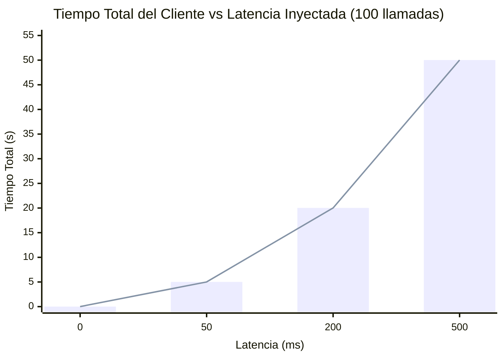

# Informe de Laboratorio N°1 (Semana 2)

**Equipo:** sd-castro-osorio · David Osorio / Felipe Castro  
**Curso:** Sistemas Distribuidos (FDICI25 / INFO35) · 02-09-2026

## 1. Entorno y método

Se midió en un equipo con Windows 11, Docker Desktop 29.7.2 y Compose v5.4.0. Se utilizó la arquitectura cliente/servidor TCP del curso en contenedores separados, conectados mediante la red `sd_net`. La herramienta `tc netem` funcionó nativamente sin necesidad del Plan B.

**Metodología:**

- **Paso 1:** Línea base (red sana) usando `ping -c 10 servidor` e `iperf3 -c servidor -t 5`.
- **Paso 2:** Ejecución de `python cliente.py` (100 y 1000 iteraciones) sin alterar la red.
- **Paso 3:** Inyección de latencia con `tc qdisc netem delay` (50, 200 y 500 ms; 100 llamadas). Total esperado: N × latencia.
- **Paso 4:** Inyección de pérdida de paquetes con `netem loss` (1 %, 5 %, 20 % y 100 %). Se registró el *throughput* de `iperf3` y el tiempo del cliente. En 100 %, se evaluó el cliente sin *timeout* y con `TIMEOUT_S=3`.

## 2. Resultados

**Línea base medida:** RTT Ping: 0.061 ms | Throughput iperf3: 23.3 Gbit/s.

### Tabla de latencia (100 llamadas)


| Latencia inyectada (`tc`) | Tiempo Total (s) | Promedio (ms) | Máximo (ms) |
| ------------------------- | ---------------- | ------------- | ----------- |
| 0 ms                      | 0.010            | 0.1           | 0.6         |
| 50 ms                     | 5.018            | 50.2          | 50.3        |
| 200 ms                    | 20.025           | 200.3         | 200.5       |
| 500 ms                    | 50.026           | 500.3         | 500.6       |


### Tabla de pérdida de paquetes


| Pérdida (`tc`) | Throughput `iperf3` | Tiempo total cliente (s)        |
| -------------- | ------------------- | ------------------------------- |
| 1 %            | 9.07 Gbit/s         | 0.011                           |
| 5 %            | 0.209 Gbit/s        | 0.629                           |
| 20 %           | 839 Kbit/s          | 12.026                          |
| 100 %          | —                   | Error inmediato / timeout 3.0 s |


### Gráfico de Degradación Lineal




## 3. Observado vs esperado

**Coincidencias (Pasos 2 y 3):**  El cliente es secuencial; espera cada `PONG` antes de enviar el siguiente `PING`. Esto hizo que el tiempo total encajara perfectamente en la fórmula (N x latencia), sumando un pequeño *delay* (ej. 5.018 s para 50 ms).

**Discrepancias (Paso 4):**
La guía decía que con pérdida el cliente seguiría “funcionando”, pero el máximo se dispararía (TCP retransmitiendo). Eso lo vimos al 5 % (máx 206 ms, total 0.629 s) y al 20 % (máx 6783 ms, total 12.026 s). Al **1 %** casi no se notó: el cliente tardó 0.011 s, parecido a la red sana. `iperf3` sí bajó, de 23.3 a 9.07 Gbit/s. No explicamos el mecanismo; solo que el cliente con 100 mensajes chicos casi no se enteró y la prueba de throughput sí.

Al **100 % de pérdida**, retornó de inmediato el error `[Errno 113] No route to host` antes de iniciar la lectura. Con `TIMEOUT_S=3`, abortó correctamente a los 3 segundos.

## 4. La falacia que asumimos

**“La latencia es cero”.** En el lab lo notamos al poner delay: las mismas 100 llamadas pasaron de 0.010 s a 5 s, 20 s y 50 s. El total era casi 100 veces el delay de `tc`. En `cliente.py` se ve por qué, **línea 29**:

```python
respuesta = f.readline()  # el cliente ESPERA a la red
```

Tratamos esa espera como si no existiera (como una función local). Por eso 500 ms × 100 salió ~50 s.

**Qué lo corregiría:** no esperar uno por uno si las llamadas no dependen entre sí. Un `TIMEOUT_S` no acorta esas 50 s; solo deja de esperar cuando la red ya no responde.

## 5. Relación con la investigación (Evaluación 1)

En la Evaluación 1 investigamos **juegos multijugador online**: servidores de partida y lag. Es la misma falacia que vimos aquí: **“la latencia es cero”**. El cliente del lab esperaba cada `PONG` como si la red no existiera; en un juego, el jugador espera que lo que hace (disparar, moverse) se vea al tiro en el servidor y en los demás. En el lab, 500 ms × 100 llamadas fueron ~50 s. En una partida, esos mismos milisegundos se sienten como lag: el personaje “va atrás”, un hit no cuenta, o la acción llega tarde. No hace falta que la red se caiga; con delay (como el de `tc`) el sistema ya se degrada. Lo que medimos con `netem delay` es, a escala de laboratorio, lo que un jugador llama lag.